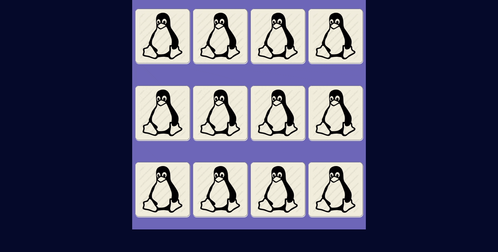

# Tux Memory Game

This is a experimental Linux distros based memory game written in JavaScript Vanilla for learning purposes.

Based on marina-ferreira memory game hosted on https://marina-ferreira.github.io/tutorials/js/memory-game/

## Play on: [Online demonstration](https://github.com/Eduard0x6F/tux-memory-game.git)

## Demonstration play:

